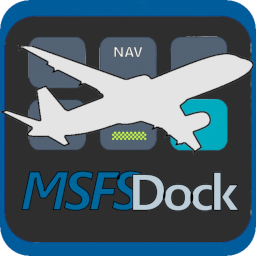
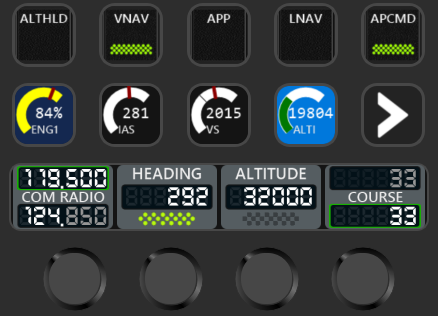
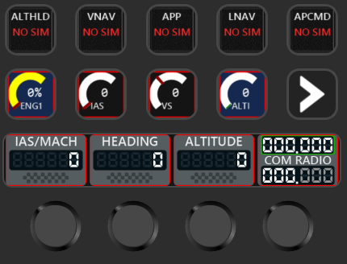

# MSFSDock - plugin for MSFS2024 for Mirabox\Ajazz Streamdock and Elgato Streamdeck devices (v0.8.0.0)

# Usage example
|  |  |
|---------|---------|
| Boeing style skin | Airbus style skin |

# Description
MSFSDock plugin for Ajazz AKP05, Mirabox N4 and other compatible devices, and also original Elgato Streamdeck. Plugin allows interaction with Microsoft Flight Simulartor 2020 and 2024, read sim variable, toggle actions, change values etc.

# !!!! Attention on updating to 0.8.0.0+ !!!!
Version 0.8.0.0 has breaking changes for old actions. If you update plugin from version less than 0.8.0.0 to 0.8.0.0+ your action won't work.

But there is a way to save then. To do so follow this instruction.
- Export your scene(s) with MSFSDock actions from software (SDProfile files)
- Run convert.py script located in utils folder of a plugin (python 3.6+ required)

    python convert.py PATH_TO_EXPORTED_SDProfile_file

- This will create new SDProfile file nearby. Now import it into software and it should work.
- If you had Gauge actions, you will need to repick colors in action settings.

# Elgato Streamdeck support
Since version 0.8.0.0 plugin should work on Elgato Streamdeck, but since I have no such hardware so my testing options are limited. Buttons should work, encoders, not so sure. Could require additional tweaks. Please leave feedback if you try it.

# Startup procedure

Since v0.6.0 no autoconnect to sim is available. By default plugin will be in disconnected state.

You will see NO SIM text on a buttons and red border on another actions in that state.

This was done to prevent excessive memory allocation when constantly trying to connect to sim (known SimConnect behavior).

Plugin will attempt to connect to sim on any Button\Knob\Display press if in disconnect state.

So correct procedure would be:
- Start sim
- After sim loaded atleast to menu press any button\knob\screen on streamdock.
- If you see NO SIM text and red borders gone then you good to go.
- Plugin will remain connected until sim closed (or crashed, as usual), in that case start from first step again.

# Supported vars and events
This plugin supports regular variables along with L-vars and MobiFligtht\WASM events. For example:
- AUTOPILOT ALTITUDE LOCK VAR:3 - regular variable, could pick it from MSFS-SDK
- AUTOPILOT NAV1 LOCK - regular variable, could pick it from MSFS-SDK
- MobiFlight.FCC_ALTITUDE_SEL_Inc - event from MobiFlight WASM module
- MobiFlight.FCC_VERTICAL_SPEED_SEL_Dec - event from MobiFlight WASM module
- L:AS01B_AUTO_THROTTLE_ARM_STATE - L-var variable, you should google them or use Devmode to find them
- L:AP_VS_ACTIVE - L-var variable, you should google them or use Devmode to find them
## Entering event\variable hints
When entering any text into event\variable input field plugin will show known events\variables list, from which you can peek needed event\varible.
Possibility to enter custom events\variables still remains (L-var or Mobiflight for example).
NOTE: Inserted event\variable will only be saved and sent to plugin in next scenarios:
1. After variable or event input [✓] button to the right of input field pressed.
2. After variable or event input enter is pressed when input field is active.

Examples:
1. You want a button to trigger parking brakes. Steps would be:
- Add MSFS Dock Generic button action to layout.
- In Button event field start printing (for example) "brakes".
- Click on "PARKING_BRAKES" from list.
- Press [✓] button to the right of input field or hit enter.
- Now pressing this button will trigger parking brakes on and off.
2. You want to display light on a button when AP is active in your 737 Max. This is L-var variable. Steps would be:
- Add MSFS Dock Generic button action to layout.
- In Status variable field print "L:AP_VS_ACTIVE".
- Press [✓] button to the right of input field or hit enter.
- Now light on this button wil display your 737 Max AP status.

# Plugin Actions
## Generic Button
This action intended to implement plane button on Stream Dock button. Button can display header, active state and value if necessary.
Controller - button.
### Generic Button parameters:
- Header - header to be displayed on a button
- Skin - select button skin, either Boeing-like or Airbus-like
- Button event - event to be triggered by button press
- Display variable - Variable used in displaying additional data on a button if necessary
- Status variable - Variable used in displaying active status (green light in the button bottom)

## Conditional Button
This action intended to implement plane events depending on conditions. This allows button to send different events based on SimConnect variable value.
For example, you could configure Autopilot button to send AP_MASTER event to turn AP on when it's off, and same AP_MASTER event to turn it off when it's on.
Or configure Landing Gear button to send GEAR_UP when gear is extended and GEAR_DOWN when gear is retracted, based on GEAR TOTAL PCT EXTENDED variable value.
### Conditional Button parameters:
- Header - header to be displayed on a button
- Skin - select button skin, either Boeing-like or Airbus-like
- Compare Var - Variable to evaluate for condition
- Operator - Comparison operator (==, !=, >, <, >=, <=)
- Compare Value - Value to compare against
- When True - Event to send when condition is true
- When False - Event to send when condition is false
- Display variable - Variable used in displaying additional data on a button if necessary
- Status variable - Variable used in displaying active status (green light in the button bottom)

#### Conditional Events
Conditional mode supports 6 comparison operators:
- == (Equal) - condition is true when variable equals specified value
- != (Not Equal) - condition is true when variable differs from specified value
- \> (Greater Than) - condition is true when variable is greater than specified value
- < (Less Than) - condition is true when variable is less than specified value
- \>= (Greater or Equal) - condition is true when variable is greater than or equal to specified value
- <= (Less or Equal) - condition is true when variable is less than or equal to specified value

Suggested configuration for smart Autopilot altitude lock toggle:
- Conditional Variable: AUTOPILOT ALTITUDE LOCK
- Operator: == (Equal)
- Condition Value: 1
- Event When True: AP_ALT_HOLD_OFF (to turn off AP ALTITUDE LOCK when it is on)
- Event When False: AP_ALT_HOLD_ON (to turn on AP ALTITUDE LOCK when it is off)
- Status variable: AUTOPILOT ALTITUDE LOCK (to show green light when ALTITUDE LOCK is active)

## Generic Switch
This action intended to implement plane switch on Stream Dock button. Switch can have either 2 or 3 position, positions could be labled.
Controller - button.
### Generic Switch parameters:
- Header - header to be displayed on a switch.
- Switch event - event to be triggered by button press, usually switch toggle event.
- Switch variable - Variable used in displaying switch position.
- Num positions - Select 2 or 3 position switch mode.
- Positions - Define mapping of switch position value in sim (left field) and displayed text (right field, 5 characters max).

## Generic Gauge
This action intended to display data from Sim on Stream Dock button with gauge like interface. Gauge supports two skins - circular (classic round gauge) and vertical (bar gauge).
Controller - Button.
### Generic Gauge parameters:
- Header - header to be displayed on a gauge
- Display variable - Variable used in displaying data
- Skin - select gauge skin, Circular (round gauge) or Vertical (bar gauge)
- Format - Format of displayed data, integer or percent value.
- Style - Select gauge style, Indicator - display current value with indicator on a scale, Fill - fill scale up to current value
- Min value - Minimum value of a gauge
- Max value - Maximum value of a gauge
- Scale - choose scale color (default - Yellow)
- Indicator - choose indicator color (default - Red)
- Background - choose background color (default - Black)

#### Vertical gauge specific
When Vertical skin is selected additional options become available:
- Scale markers - add colored tick marks at specific values on the scale. Each marker has two parameters:
    - Position - the value on the scale where the marker should appear, must be within the configured Min/Max range
    - Color - the color of the tick mark

  Useful for marking operational limits, caution ranges, level notches etc. When Percent format is selected, displayed value is calculated based on the configured minimum and maximum values.

## Generic Dial (single)
This action intended to implement plane dial on Stream Dock display. Dial can display value, change value by rotating a knob, call event by pressing a knob/screen.
Controller - Knob/Display.
### Generic Dial parameters:
- Header - header to be displayed on a dial
- Skin - select dial skin, either Boeing-like or Airbus-like
- Display variable - Variable to display on a dial
- Inc event - event to be triggered by rotating knob clockwise
- Dec event - event to be triggered by rotating knob counterclockwise
- Knob event - event to be triggered by pushing a knob or screen.
- Status variable - Variable used in displaying active status (bottom field of a dial)

## Dual Dial
This action intended to implement two separate dials on Stream Dock display. Dials can display values, change value of active dial (highlighted) by rotating a knob, active dial changes by pushing knob or display. This could be usefull for pair values like Course, Radios etc, or just to save some space.
Controller - Knob/Display.
### Dual Dial parameters:
- Header - header to be displayed on a dial
- Skin - select dial skin, either Boeing-like or Airbus-like
- Dial 1 variable - Variable to display on dial 1
- Inc 1 event - event to be triggered by rotating knob clockwise when dial 1 is active
- Dec 1 event - event to be triggered by rotating knob counterclockwise when dial 1 is active
- Dial 2 variable - Variable to display on dial 2
- Inc 2 event - event to be triggered by rotating knob clockwise when dial 2 is active
- Dec 2 event - event to be triggered by rotating knob counterclockwise when dial 2 is active

## Generic Radio
This action intended to display active and standby radios (NAV, COM etc), change whole and fractional part and swap between them.
Controller - Knob/Display.
### Generic Radio parameters:
- Header - header to be displayed on a radio card
- Skin - select radio skin, either Boeing-like or Airbus-like
- Active Radio var - Variable used to display active radio frequency
- Stdby Radio var - Variable used to display standby radio frequency
- Inc event - event to increase standby frequency whole part
- Dec event - event to dencrease standby frequency whole part
- Inc frac event - event to increase standby frequency fractional part
- Dec frac event - event to dencrease standby frequency fractional part
- Swap event - event to swap standby and active frequency (called by screen doubletap or knob doublepress).

#### Changing frequency
Since we have only 1 knob then only whole part either fractional part could be changed at once.
Part of the frequency modifiable now is highlighted. To switch between parts tap the screen or press the knob once.

#### Notes on frequency Swap event
If you configure Swap event then you can swap between frequencies by double tapping a screen or double pressing a knob.
Since it could be finiky for someone then there is always an option to assign Swap event to separate button.

# Installation and configuration

## Mirabox/Ajazz
Copy `com.rvoronov.msfsDock.sdPlugin` folder into `%appdata%/Hotspot/StreamDock/plugins/`.
Create new action, configure appropriate variables and events for action, run sim.

## Elgato
Doubleclick com.rvoronov.msfsDock.sdPlugin.streamDeckPlugin file, Elgato app will open and offer you to install a plugin.
Create new action, configure appropriate variables and events for action, run sim.

# Known issues and limitations
- Most actions display only INT values, except RADIO and GAUGE (could display percents as well)
- Probably a lot of bugs with registering\deregistering variables and events

# Links and info
Github page: https://github.com/voronovrs/MSFSDock

Standart event IDs could be found here https://docs.flightsimulator.com/html/Programming_Tools/Event_IDs/Event_IDs.htm

Standart variables could be found here https://docs.flightsimulator.com/html/Programming_Tools/SimVars/Aircraft_SimVars/Aircraft_AutopilotAssistant_Variables.htm

You may need to do some research to find L-vars for specific plane, configure WASM/Mobiflight variables and events, this is not part of this document.
