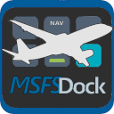

# This is work in progress

# Example setup
|  |  |
|---------|---------|
| Boeing style skin | Airbus style skin |

# Description
MSFSDock plugin for Ajazz AKP05, Mirabox N4 and other compatible devices. Plugin allows interaction with Microsoft Flight Simulartor 2020 and 2024, read sim variable, toggle actions, change values etc.

# Supported vars and events
This plugin supports regular variables along with L-vars and MobiFligtht\WASM events. For example:
- AUTOPILOT ALTITUDE LOCK VAR:3 - regular variable, could pick it from MSFS-SDK
- AUTOPILOT NAV1 LOCK - regular variable, could pick it from MSFS-SDK
- MobiFlight.FCC_ALTITUDE_SEL_Inc - event from MobiFlight WASM module
- MobiFlight.FCC_VERTICAL_SPEED_SEL_Dec - event from MobiFlight WASM module
- L:AS01B_AUTO_THROTTLE_ARM_STATE - L-value variable, you should google them or use Devmode to find them
- L:AP_VS_ACTIVE - L-value variable, you should google them or use Devmode to find them

# Plugin Actions
## Generic Button
This action intended to implement plane button on Stream Dock button. Button can display header, active state and value if necessary.
### Generic Button parameters:
- Header - header to be displayed on a button
- Button event - event to be triggered by button press
- Display variable - Variable used in displaying additional data on a button if necessary
- Status variable - Variable used in displaying active status (green light in the button bottom)

## Generic Dial (single)
This action intended to implement plane dial on Stream Dock display. Dial can display value, change value by rotating a knob, call event by pressing a knob/screen.
### Generic Dial parameters:
- Header - header to be displayed on a dial
- Display variable - Variable to display on a dial
- Inc event - event to be triggered by rotating knob clockwise
- Dec event - event to be triggered by rotating knob counterclockwise
- Knob event - event to be triggered by pushing a knob or screen.
- Status variable - Variable used in displaying active status (bottom field of a dial)

# Installation

Copy `com.rvoronov.msfsDock.sdPlugin` folder into `%appdata%/Hotspot/StreamDock/plugins/`.

# Known issues and limitations
- No choice of variable type, only integer so far
- No dual dials yet
- Probably a lot of bugs with registering\deregistering variables and events
